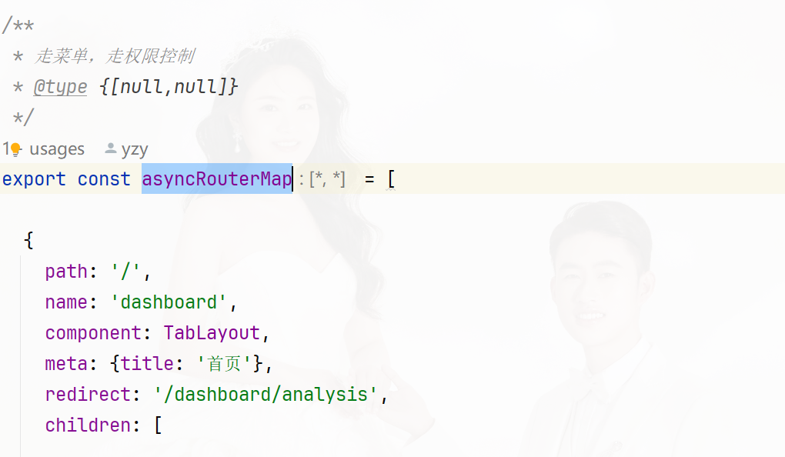
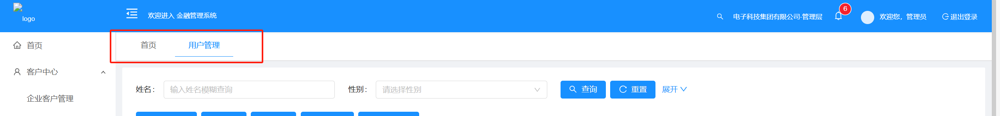
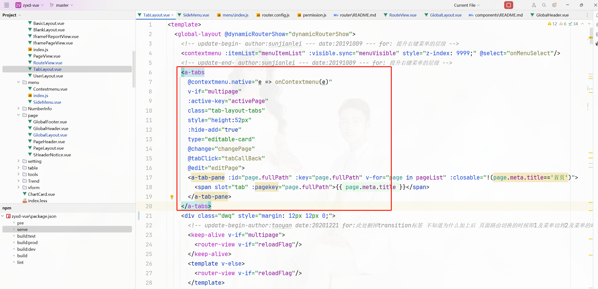

layouts+page包：系统页面布局相关组件，比如登陆进去之后页面顶部显示什么，底部显示什么，菜单点击触发多个tab的布局等等

页面的菜单，头部，底部的整体布局是这个页面GlobalLayout.vue，三个位置是以组件的形式引入整体布局页面 SideMenu, GlobalHeader, GlobalFooter

通过菜单和需要权限控制的路由是使用TabLayout.vue页面布局

页面标签是在TabLayout.vue页面中实现的

content部分是通过[<router-view>](https://www.jb51.net/javascript/32260060f.htm)动态渲染的
