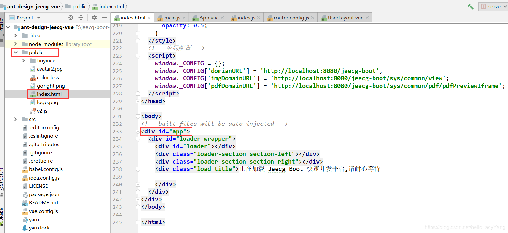
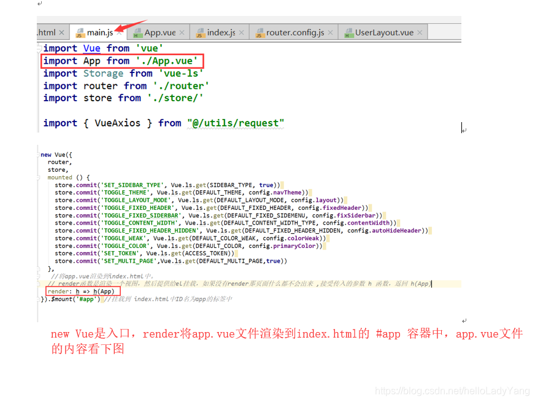
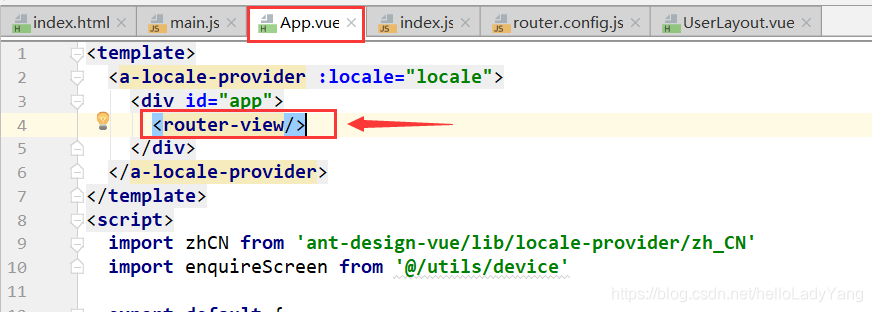
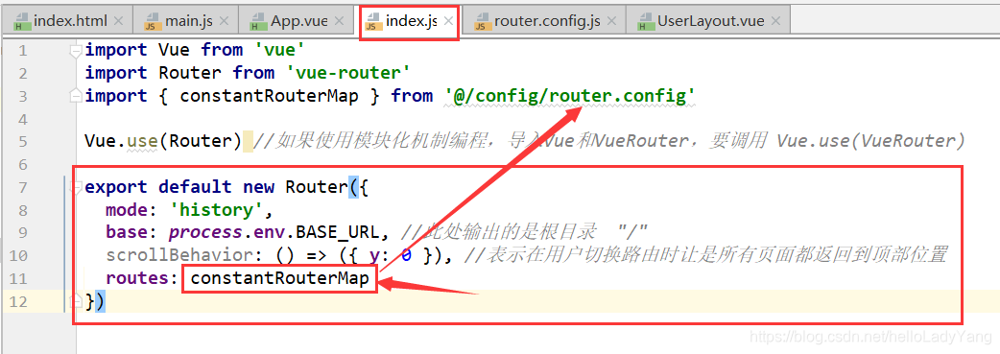
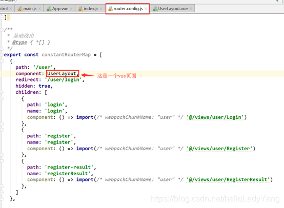
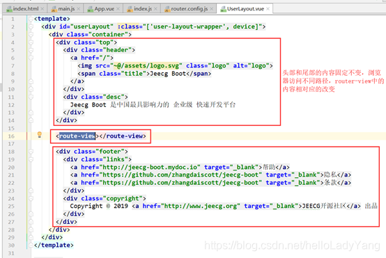
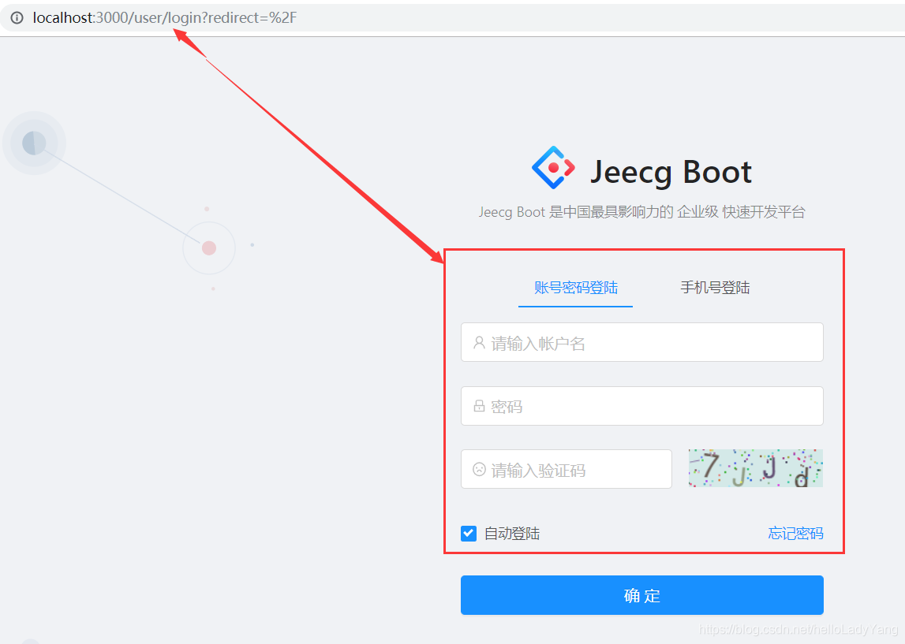

* 1、路径： index.html → main.js → app.vue → index.js → components/组件
* 2、入口文件 public目录下的index.html文件
* 3、main.js文件引入App.vue文件，渲染到index.html中
* 4、App.vue文件中主要的是router-view标签，这里的内容其实是通过路由引入进来的，router-view的内容是在index.js，请看第5点中的截图
* 5、index.js中设置一个全局的路由，参数配置是在router.config.js文件中
* 6、router.config内容解析，UserLayout.vue的router-view标签呈现什么内容在router.config的children属性中设置好了，如果浏览器访问的是localhost://8080/user/login，则是把Login.vue嵌入到UserLayout.vue，效果如第7点的截图。
* 7、效果展示

1、路径： index.html → main.js → app.vue → index.js → components/组件
2、入口文件 public目录下的index.html文件

3、main.js文件引入App.vue文件，渲染到index.html中

4、App.vue文件中主要的是router-view标签，这里的内容其实是通过路由引入进来的，router-view的内容是在index.js，请看第5点中的截图

5、index.js中设置一个全局的路由，参数配置是在router.config.js文件中

6、router.config内容解析，UserLayout.vue的router-view标签呈现什么内容在router.config的children属性中设置好了，如果浏览器访问的是localhost://8080/user/login，则是把Login.vue嵌入到UserLayout.vue，效果如第7点的截图。

7、效果展示

