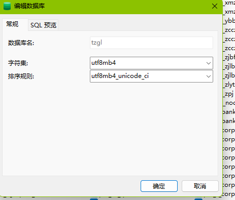

使用Navicat将8.0版本的数据库转储SQL文件->仅结构
打开导出的SQL文件，批量替换utf8mb4_0900_ai_ci为utf8mb4_unicode_ci；

将5.7数据库的字符集和排序规则调整为utf8mb4、utf8mb4_unicode_ci

选中5.7版本**数据库**运行刚才导出的仅表**结构**SQL文件

选择8.0数据库的**表**，选择导出向导->导出为SQL文件

选中5.7版本**数据库**运行刚才导出的仅表**数据**SQL文件

